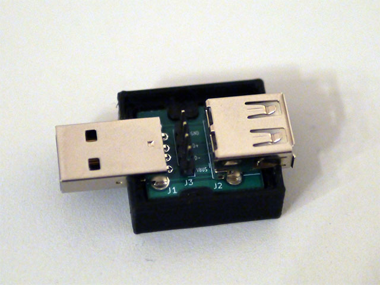
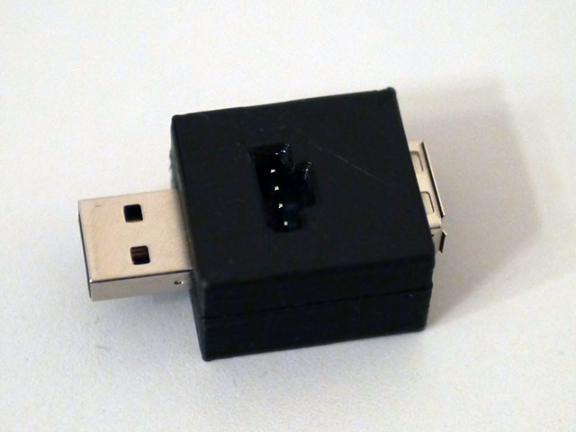

# USB Trace Adapter

The USB trace adapter can be used to trace/probe the USB communication of a
USB low speed, high speed or full speed connection with a logic analyzer
or oscilloscope.

# Structure

The USB trace adapter is build up of a USB 2.0 type A receptacle and
a USB 2.0 type A plug at both ends with a pin header in-between.
All lines are passed through between receptacle and plug as it.
The pin header offers easy access to VBUS, D+, D- and GND to allow
tracing and probing.

# Manufacturing

## PCB

Use the following parameters when ordering the PCB. Note that the values
have only been tested with JLCPCB so far. See [gerber files](hw/gerber).
- layers: 2
- base material: FR4
- dimensions: 21x18.8mm
- thickness: 1.6mm
- surface finish: lead free HASL
- impedance control: no
- outer copper weight: 1oz

With no special extras.

## BOM

- 1x [USB 2.0 type A plug](https://datasheet.lcsc.com/szlcsc/1811131825_Jing-Extension-of-the-Electronic-Co-C9739_C9739.pdf)
- 1x [USB 2.0 type A receptacle](https://datasheet.lcsc.com/lcsc/1912111437_SHOU-HAN-AF-90--WJDG_C456018.pdf)
- 1x [single row 4x pin header with 2.54mm pitch](https://datasheet.lcsc.com/lcsc/2008301604_Wcon-1125-1104G0S118C005_C721444.pdf)

All parts can be ordered at [LCSC](https://www.lcsc.com) (C9739, C456018 and C721444).

## Case

The case consists of a [bottom](print/case-Bottom.stl) and a
[top](print/case-Top.stl) part and can be 3D printed with PLA.
Other materials have not been tested.
Use the following print settings:
- layer height: 0.2mm
- nozzle diameter: 0.4mm
- infill: ≥15%
- perimeters: ≥3
- variable width perimeter generator (e.g. Arachne in PrusaSlicer)
- support: none
- print orientation: same as STL

Also recommended are:
- solid layers: ≥4
- infill pattern: adaptive cubic
- top/bottom fill pattern: monotonic

The [FreeCAD file](print/case.FCStd) contains a spreadsheet to easily change
tolerances to match the capabilities of the used 3D printer.

## Assembly

1. Solder the USB 2.0 type A plug at J1.
2. Solder the USB 2.0 type A receptacle at J2.
3. Solder the single row 4x pin header at J3.
4. Put the finished PCB into the bottom part of the case.
   The orientation is unambiguous.
   
5. Press the top part of the case onto the bottom part. Both parts should
   snap together. Make sure that the pin header hole is "pointing" towards the
   USB receptacle.
   

Note: All parts are soldered on the same side of the PCB.  
**Important:** Be sure that the USB connectors are fully inserted and
aligned when soldering. Especially when handling the USB plug.

## Connector Cable

It is possible to glue 4 female jumper cables and a small block of plastic
together to form a coded connector cable.

## Tracing

Sigrok provides ways to convert a logic trace into a PCAP file for further
analysis via Wireshark. See https://sigrok.org/blog/new-protocol-decoder-usb-request

### Example: Rigol DS1202Z-E with PulseView

This combination works fine for USB low speed (1.5 Mbps) and high speed (12 Mbps)
devices. However, it only captures a very short duration.

- Connect both probes to `D+` and `D-` and the ground to `GND`.
- Set the resolution to 5ms (trace length = 124ms, USB high speed) and the trigger to 1.5V.
- Set trigger type to `Pulse` on the channel with `D+` with less than 80ns.
- Run a single shot.
- Connect PulseView to Rigol DS1202Z-E and set its data source to `Memory`.
- Run the trace to collect the trace data.
- Set both channels to logic conversion via threshold (TTL).
- Add `USB request` decoder.

### Example: AZDelivery Logic Analyzer with sigrok

This combination works fine for USB low speed (1.5 Mbps) and may give some usable
results with USB high speed (12 Mbps) devices. Preferable is a logic analyzer with
48 MHz or more for USB high speed devices.

- Connect both probes to `D+` (CH0) and `D-` (CH1) and the ground to `GND`.
- `sigrok-cli -d fx2lafw -c samplerate=24M -C D0=DP,D1=DM --continuous -o trace.sr`.
- `sigrok-cli -i trace.sr -P usb_signalling:dp=DP:dm=DM,usb_packet,usb_request -B usb_request=pcap > trace.pcap`

Note that defining triggers does not work stable for this logic analyzer. The trace aborts shortly.

# License

See [LICENSE](LICENSE).  

# Contributions

No content contributions are accepted. Please file a bug report or feature request instead.  
This decision was made in consideration of the used license.
